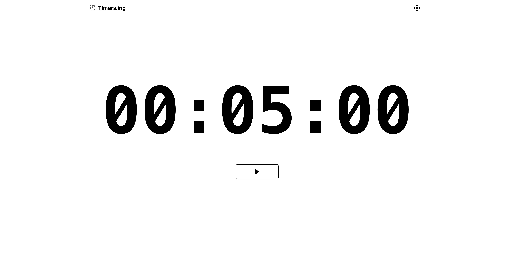

# Timers.ing



This is a repository for a timer countdown website.

## Demo
[https://timers.ing](https://timers.ing)

## Features
- [x] 🌐 Next.js 14 & server actions
- [x] 🎨 Beautiful component system using Tailwind CSS
- [x] 🚀 Deployment on Vercel
- [x] 📱 Mobile responsiveness
- [ ] 🌧 Dark mode.
- [ ] 🛍 Multiple pages.
- [ ] 🚪 Multiple languages.

## Getting started

```bash
git clone https://github.com/AiLaunchers/timers.ing.git
```
### Install packages

```bash
cd timers.ing
npm i
```

### Start the app

```bash
npm run dev
# or
yarn dev
# or
pnpm dev
# or
bun dev
```
Open [http://localhost:3000](http://localhost:3000) with your browser to see the result.

## Deploy with Vercel

[](https://vercel.com/new/clone?repository-url=https%3A%2F%2Fgithub.com%2FAiLaunchers%2Ftimers.ing)

## Credit to

- [Next.js](https://nextjs.org/docs) for full-stack development
- [Tailwind CSS](https://tailwindcss.com/) for page building

## Other

For questions or feedback, contact us on Twitter: [AiLaunchers](https://twitter.com/AiLaunchers)
